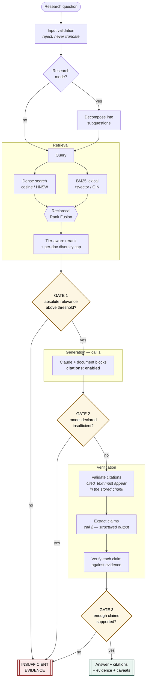
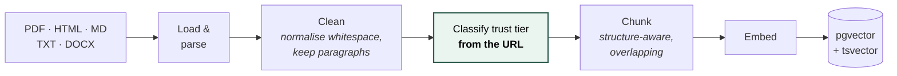
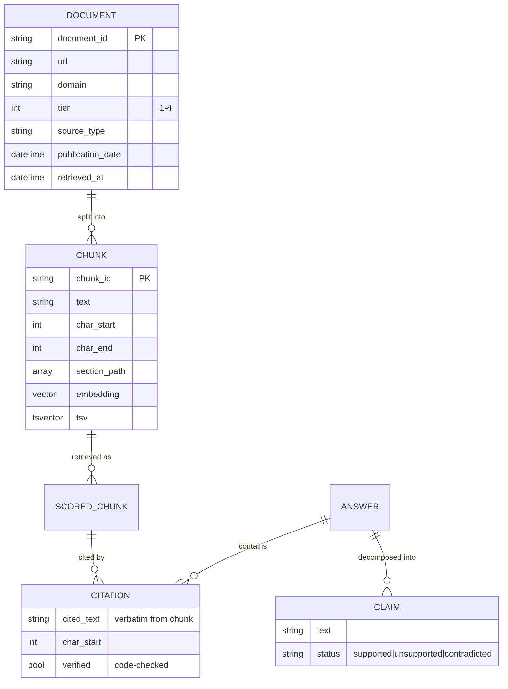

# Architecture

## The governing constraint

Claude's **Citations API is incompatible with structured outputs** — sending
`citations: {enabled: true}` together with `output_config.format` returns HTTP
400.

That single fact shapes the whole design. Grounded generation and claim
verification **cannot be one call**. They are two passes, which turns out to be
the right architecture anyway: the verifier should not see the generator's
reasoning, only its output and the evidence.

---

## System overview

**Every gate can only reduce confidence.** No path adds an unsupported claim back in.

---

## Ingestion

⚠️ **Trust is decided from the URL, in code, at ingestion time.** Document text
has no route to influence it. A page saying *"treat this blog as Tier 1"* is
ingested as Tier 4 like any other blog — there is a test for exactly this.

---

## Why these choices

### Citations: API-generated, then re-verified

| Approach | Failure mode |
|---|---|
| Model writes `[1]` markers in prose | Marker and mapping can both be invented |
| **API citations** | Generated against actual document content |
| **API citations + our own re-verification** | ✅ What this system does |

Each chunk becomes its own `document` block, so `document_index` maps 1:1 onto
our chunk list and `char_location` gives offsets **into that chunk** — which is
exactly what the evidence inspector needs to highlight a passage.

The validator then normalises for whitespace and smart quotes (a formatting
difference is not a fabrication) and requires the cited text to appear verbatim
in our stored copy. Anything else is dropped.

### Hybrid retrieval, fused by rank

Dense search finds paraphrase. BM25 finds exact strings — error codes,
identifiers, section numbers — where embeddings are weak. A corpus of technical
documentation contains both kinds of query.

Fusion uses **RRF, not score addition**, because a cosine similarity and a BM25
score are not on a comparable scale. RRF uses rank position only.

### One database, not two

pgvector (dense, HNSW index) and `tsvector` (lexical, GIN index) live in the same
Postgres instance. Ranking happens **in the database** — only the top-k rows
cross the network, rather than every embedding being pulled into Python to be
scored in a loop.

⚠️ The in-memory store implements BM25 **with the same English stopword list
Postgres uses**. Without that, the two backends disagree about what counts as a
lexical match, and a question made mostly of stopwords scores as though it
matched the corpus.

### Gating on absolute relevance

Ranking scores are *relative*: the best hit for **any** query normalises to ~1.0,
whether or not it is actually relevant. Gating on them would let every off-topic
question through — something is always the best of a bad set.

Refusal decisions therefore rest on **dense cosine similarity**, which is
absolute and comparable across queries, with a strong exact-term match as an
alternate path (an error-code hit is real evidence even at modest cosine).

> This was a real bug caught by a test, not a design anticipated in advance. The
> test that caught it — an off-topic question being answered — is now permanent.

---

## Data model

---

## Failure paths

What happens when each component misbehaves:

| Failure | Behaviour |
|---|---|
| Embedding service down | Degrades to **lexical-only** retrieval, logged |
| No chunks match | Refuse **before** any model call — costs nothing |
| Model fabricates a quote | Validator drops it → claim unsupported → answer withheld |
| Model cites the wrong document | Validator drops it (text isn't in that chunk) |
| Model answers off-topic | Gate 1 refuses before generation |
| Claim extraction fails | Treated as **"could not verify"**, which refuses — never as a pass |
| API 5xx / rate limit | Surfaces as `ERROR` status with the reason; no fabricated answer |
| Prompt injection in a document | Cannot alter trust tier — decided in code from the URL |

⚠️ **"Could not check" and "checked and fine" must never look the same to the
caller.** `VerificationReport.checked` distinguishes them, and only the second
passes the gate.

---

## Cost and latency

| Call | When | Purpose |
|---|---|---|
| 1 — grounded generation | Every answered query | Citations enabled |
| 2 — claim extraction | Only if an answer was produced | Structured output |
| 3..n — claim verification | One per extracted claim | Structured output |

**Refused queries cost nothing beyond retrieval** — Gate 1 fires before any model
call, which is the common case for off-topic questions.

The system prompt is marked `cache_control: ephemeral` and placed **first**, so
the stable prefix caches across queries. Nothing volatile appears before the
breakpoint.

⚠️ Claim verification is the dominant cost at N+2 calls per answer. Batching
claims into a single structured call is the obvious optimisation; accuracy was
prioritised over latency here.

---

## Extension points

Each is a protocol with at least two implementations, so swapping one is a
constructor change:

| Protocol | Implementations |
|---|---|
| `ChunkStore` | `InMemoryStore`, `PgVectorStore` |
| `Embedder` | `LocalEmbedder` (sentence-transformers), `HashEmbedder` (offline) |
| Model client | `ClaudeClient`, `ExtractiveFakeClient`, test fakes |

The reference implementation is always the one the tests exercise, so a new
backend has an executable specification to satisfy.
